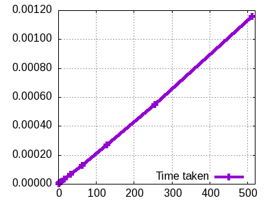

# Hash generatorius

## Projekto struktūra
```
bgt-hash
├── Makefile
├── README.md
├── hash.cpp
├── hash.hpp
├── main.cpp
├── testing
│   ├── final-tests.sh
│   ├── generate-files.sh
│   ├── run-all.sh
│   └── test-2.sh
└── timer.hpp

1 directory, 10 files
```

## Projekto setup'as

```bash
# clone the repository
git clone https://github.com/richard96292/bgt-hash

# compile program with make (must be inside the root project folder)
make

# hash abc string
./bin -s "abc"

# the same but with a file
printf abc > test.txt
./bin -f test.txt

# run tests
cd testing
# run the test script with newly generated files (-g option generates new files)
./run-all.sh -g
```

## Command Line Argument'ai

```bash
# run the binary without any flags or with -h flag to get these
pass -f and a filename to read from a file
pass -s to read from stdin
pass -b to run a suite of tests (files must be generated beforehand)
pass -n to and a filename and number of lines as an argument. Format is "2 file.txt" (dont forget quotes)
```

## Pseudocode
```bash
start with original message with length of L bits

append N 8 bit values 101010 until message is a multiple of 1024 bits

append original message length as last 64 bits bits to the message

process the message in 1024 bit chunks
  create array of 128 32bit words

  generate first 32 words from the initial message
    convert 4 8bit values into 1 32bit value

  generate the rest 96 words
    W[j] = fun1(W[j - 30]) + rotr(W[j - 4], 3) + fun0(W[j - 7]) + fun0(W[j - 32]);

  initialize H (8 32bit values) with initial numbers

  loop through each of 128 word
    tempWord1 = ufun0(H[3]) + majority(H[1], H[2], H[3]) + H[7] + K[j] + W[j];
    tempWord2 = ufun1(H[0]) + choice(H[5], H[6], H[7]);

    move every word in H up

    H[7] = (T1 + T2) ^ T2;
    H[3] += T1;

  for all initial values where i is iterator
    new initial value[i] += H[i]

convert initial values to hex and merge them
```


## Testavimas

### 1 - 3 reikalavimai
Hash funkcija atitinka 1-3-ą reikalavimus, t.y., nepriklausomai nuo Input'o, Output'ai
visada yra vienodo dydžio, o to paties failo hash'as yra tas pats.

```
------------------- Test case 1 single character----------------
First file:
9e039ef6b06af393806619b2efe6fafac37df72b83a93c7341b90300c709751b
9e039ef6b06af393806619b2efe6fafac37df72b83a93c7341b90300c709751b

Second file:
4e62691e42b510e905514218c4dc3376214cbc63815b86648d65d76ee66dda2d
4e62691e42b510e905514218c4dc3376214cbc63815b86648d65d76ee66dda2d
------------------- Test case 2 long file ----------------------
First file:
4485bf98961efb188161cc786ee27f973428ed6c356f7c278b99adce7fd1edf3
4485bf98961efb188161cc786ee27f973428ed6c356f7c278b99adce7fd1edf3

Second file:
8e67c1d95b9c6088f39eb318d401203b4df66b6371d63b1044765f49cf911e1e
8e67c1d95b9c6088f39eb318d401203b4df66b6371d63b1044765f49cf911e1e
------------------- Test case 3 one different character --------
First file:
2392502860e918b37662cfb885954952a22abd6acb4db199b5bbf612821a385e
2392502860e918b37662cfb885954952a22abd6acb4db199b5bbf612821a385e

Second file:
f2de7e5629449702bb7ff76a54cc0f5d33998fd42bbd1630a78e5bd230d7c653
f2de7e5629449702bb7ff76a54cc0f5d33998fd42bbd1630a78e5bd230d7c653
------------------- Test case 4 empty file ---------------------
First file:
00877339f1e30131eb921636c3f292dc43784098f6d2c72be0a62041ae8b43e6
00877339f1e30131eb921636c3f292dc43784098f6d2c72be0a62041ae8b43e6
```

### Hash funkcijos efektyvumas

Hashavimo funkcijos sudėtingumas yra tiesinis O(n). Buvo suhash'uotas failas konstitucija.txt ir išmatuota kiek laiko visa tai užtruko. Kiekvienas testo etapos buvo daromas 100 kartų. Apačioje pateikti suvidurkinti testo rezultatai.

#### Grafikas



#### Laikas
```
Reading 1 lines took 0.000002 sec.
Reading 2 lines took 0.000004 sec.
Reading 4 lines took 0.000008 sec.
Reading 8 lines took 0.000016 sec.
Reading 16 lines took 0.000031 sec.
Reading 32 lines took 0.000068 sec.
Reading 64 lines took 0.000127 sec.
Reading 128 lines took 0.000270 sec.
Reading 256 lines took 0.000546 sec.
Reading 512 lines took 0.001157 sec.
```

### Testing collisions
Buvo sugeneruotos 100000 atsitiktinių simbolių eilučių porų. Toje pačioje poroje esančių string'ų ilgiai sutampa. Yra 25 000 porų, kurių ilgis 10 simbolių, kitas 25 000 porų, kurių ilgis - 100, dar kitas 25 000 poras - 500, ir 25 000 poras, kurių ilgis - 1000 simbolių.

Naudodamas sugeneruotas poras, patikrinau, kad visais atvejais gautieji
porų hash'ai nesutampa.

```
No collisions were found. Test is successful!
```
### Testing hex and bin level difference between two hashes

Bitų lygmenyje procentinis skirtingumas visada yra mažesnis negu hex'ų lygmenyje. Bent minimaliai pakeitus įvedimą maišos funkcijos rezultatas skiriasi iš esmės. Yra tenkinamas taip vadinamas lavinos efektas.

```
Min diff: hex - 76.5625%, bin - 24.0234%
Avg diff: hex - 93.755%, bin - 33.0268%
Max diff: hex - 100%, bin - 42.5781%
```
